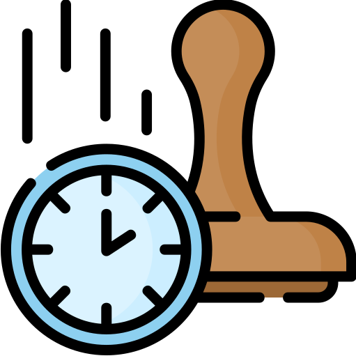

<p align="center">
  
  <h2 align="center">Timestampy</h2>
  <p align="center">Bunch of utilities useful when working with UNIX timestamps 🕒<p>
  
<p align="center">  
<a href="https://travis-ci.org/xxczaki/timestampy"></a> <a href="https://github.com/sindresorhus/xo"></a>
  </p>

---

## Highlights

* Simple API
* No dependencies
* Tree Shakeable
* Written in TypeScript

## Install

```
npm install timestampy
```

<a href="https://www.patreon.com/akepinski">
	
</a>

## Usage

```js
import {addHours, toDate} from 'timestampy'

addHours(1546344000, {amount: 3}); //=> 1546354800
toDate(1564146357); //=> '7/26/2019'
```

## API

* [Add](#Add)
    * addSeconds
    * addMinutes
    * addHours
    * addDays
    * addWeeks
    * addMonths
    * addYears
* [Subtract](#Subtract)
    * subtractSeconds
    * subtractMinutes
    * subtractHours
    * subtractDays
    * subtractWeeks
    * subtractMonths
    * subtractYears
* [Is](#Is)
    * isOlderThan
    * isNewerThan
    * isMinuteOld
    * isHourOld
    * isDayOld
    * isWeekOld
    * isFortnightOld
    * isMonthOld
    * isHalfYearOld
    * isYearOld
    * isOldCustom
* [To](#To)
    * toDate
    * toTime
* [Other](#Other)
    * getCurrentTimestamp
    * howOld

---

## Add

#### addSeconds(timestamp, {options})

Returns a modified timestamp.

##### timestamp

Type: `number`

UNIX Timestamp.

##### options

Type: `object`

Any of the options below.

###### amount

Type: `number`

The amount of seconds you want to add to the timestamp.

#### addMinutes(timestamp, {options})

Returns a modified timestamp.

##### timestamp

Type: `number`

UNIX Timestamp.

##### options

Type: `object`

Any of the options below.

###### amount

Type: `number`

The amount of minutes you want to add to the timestamp.

#### addHours(timestamp, {options})

Returns a modified timestamp.

##### timestamp

Type: `number`

UNIX Timestamp.

##### options

Type: `object`

Any of the options below.

###### amount

Type: `number`

The amount of hours you want to add to the timestamp.

#### addDays(timestamp, {options})

Returns a modified timestamp.

##### timestamp

Type: `number`

UNIX Timestamp.

##### options

Type: `object`

Any of the options below.

###### amount

Type: `number`

The amount of days you want to add to the timestamp.

#### addWeeks(timestamp, {options})

Returns a modified timestamp.

##### timestamp

Type: `number`

UNIX Timestamp.

##### options

Type: `object`

Any of the options below.

###### amount

Type: `number`

The amount of weeks you want to add to the timestamp.

#### addMonths(timestamp, {options})

Returns a modified timestamp.

##### timestamp

Type: `number`

UNIX Timestamp.

##### options

Type: `object`

Any of the options below.

###### amount

Type: `number`

The amount of months you want to add to the timestamp.

#### addYears(timestamp, {options})

Returns a modified timestamp.

##### timestamp

Type: `number`

UNIX Timestamp.

##### options

Type: `object`

Any of the options below.

###### amount

Type: `number`

The amount of years you want to add to the timestamp.

## Subtract

#### subtractSeconds(timestamp, {options})

Returns a modified timestamp.

##### timestamp

Type: `number`

UNIX Timestamp.

##### options

Type: `object`

Any of the options below.

###### amount

Type: `number`

The amount of seconds you want to subtract from the timestamp.

#### subtractMinutes(timestamp, {options})

Returns a modified timestamp.

##### timestamp

Type: `number`

UNIX Timestamp.

##### options

Type: `object`

Any of the options below.

###### amount

Type: `number`

The amount of minutes you want to subtract from the timestamp.

#### subtractHours(timestamp, {options})

Returns a modified timestamp.

##### timestamp

Type: `number`

UNIX Timestamp.

##### options

Type: `object`

Any of the options below.

###### amount

Type: `number`

The amount of hours you want to subtract from the timestamp.

#### subtractDays(timestamp, {options})

Returns a modified timestamp.

##### timestamp

Type: `number`

UNIX Timestamp.

##### options

Type: `object`

Any of the options below.

###### amount

Type: `number`

The amount of days you want to subtract from the timestamp.

#### subtractWeeks(timestamp, {options})

Returns a modified timestamp.

##### timestamp

Type: `number`

UNIX Timestamp.

##### options

Type: `object`

Any of the options below.

###### amount

Type: `number`

The amount of weeks you want to subtract from the timestamp.

#### subtractMonths(timestamp, {options})

Returns a modified timestamp.

##### timestamp

Type: `number`

UNIX Timestamp.

##### options

Type: `object`

Any of the options below.

###### amount

Type: `number`

The amount of months you want to subtract from the timestamp.

#### subtractYears(timestamp, {options})

Returns a modified timestamp.

##### timestamp

Type: `number`

UNIX Timestamp.

##### options

Type: `object`

Any of the options below.

###### amount

Type: `number`

The amount of years you want to subtract from the timestamp.

## Is

#### isOlderThan(firstTimestamp, secondTimestamp)

Returns a `boolean` of whether the `firstTimestamp` is older than the `secondTimestamp`.

##### firstTimestamp

Type: `number`

UNIX Timestamp.

##### secondTimestamp

Type: `number`

UNIX Timestamp.

#### isNewerThan(firstTimestamp, secondTimestamp)

Returns a `boolean` of whether the `firstTimestamp` is newer than the `secondTimestamp`.

##### firstTimestamp

Type: `number`

UNIX Timestamp.

##### secondTimestamp

Type: `number`

UNIX Timestamp.

#### isMinuteOld(timestamp)

Returns a `boolean` of whether the `timestamp` is at least minute old (from now).

##### timestamp

Type: `number`

UNIX Timestamp.

#### isHourOld(timestamp)

Returns a `boolean` of whether the `timestamp` is at least an hour old (from now).

##### timestamp

Type: `number`

UNIX Timestamp.

#### isDayOld(timestamp)

Returns a `boolean` of whether the `timestamp` is at least a day old (from now).

##### timestamp

Type: `number`

UNIX Timestamp.

#### isWeekOld(timestamp)

Returns a `boolean` of whether the `timestamp` is at least week old (from now).

##### timestamp

Type: `number`

UNIX Timestamp.

#### isFortnightOld(timestamp)

Returns a `boolean` of whether the `timestamp` is at least 2 weeks (from now).

##### timestamp

Type: `number`

UNIX Timestamp.

#### isMonthOld(timestamp)

Returns a `boolean` of whether the `timestamp` is at least month old (from now).

##### timestamp

Type: `number`

UNIX Timestamp.

#### isHalfYearOld(timestamp)

Returns a `boolean` of whether the `timestamp` is at 6 months old (from now).

##### timestamp

Type: `number`

UNIX Timestamp.

#### isYearOld(timestamp)

Returns a `boolean` of whether the `timestamp` is at least year old (from now).

##### timestamp

Type: `number`

UNIX Timestamp.

#### isOldCustom(timestamp, {options})

Returns a `boolean` of whether the `timestamp` is at least year old (from now).

##### timestamp

Type: `number`

UNIX Timestamp.

##### options

Type: `object`

Any of the options below.

###### time

Type: `number`

How old the timestamp should be for the function to return `true`.

## To

#### toDate(timestamp)

Returns a date extracted from timestamp.

##### timestamp

Type: `number`

UNIX Timestamp.

#### toTime(timestamp)

Returns time extracted from timestamp.

##### timestamp

Type: `number`

UNIX Timestamp.

## Other

#### getCurrentTimestamp()

Returns a current UNIX timestamp.

#### howOld(timestamp)

Returns the amount of second of how old the given timestamp is (from now).

##### timestamp

Type: `number`

UNIX Timestamp.

## License

MIT © [Antoni Kepinski](https://kepinski.me)

Timestamp icon made by <a href="https://www.flaticon.com/authors/freepik" title="Freepik">Freepik</a> from <a href="https://www.flaticon.com/"                 title="Flaticon">www.flaticon.com</a> is licensed by <a href="http://creativecommons.org/licenses/by/3.0/"                 title="Creative Commons BY 3.0" target="_blank">CC 3.0 BY</a>
